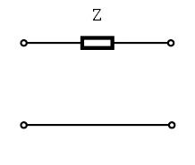

# An Example: Impedance Transform (Matching) Network Does Not Exist

Suppose we have a preamplifier SA that has $`Z_{\mathrm{n,opt}}=2~\Omega`$ and $`Z_{\mathrm{amp}}=50~\Omega`$. At first glance, it decouples coils as well as WanTCom WMA32C, which roughly has $`Z_{\mathrm{n,opt}}=50~\Omega`$ and $`Z_{\mathrm{amp}}=2~\Omega`$. Both of them have $`\Gamma_{\mathrm{out}}=0.923~1`$.

However, for the high-impedance case, preamplifier SA violates the validity requirement: $`X_{\mathrm{amp}}+X_{\mathrm{out}}=0`$, but $`R_{\mathrm{n,opt}}=R_{\mathrm{out}}<R_{\mathrm{amp}}`$. Therefore, we cannot match a coil to it for the best decoupling. To verify that, take $`Z_{\mathrm{coil}}=0.382+\mathrm{j}33.9~\Omega`$ (case A in Table 1 of [Wang2023-MRM](./References.md#Wang2023-MRM)). The matching network has 
```math
\begin{aligned}
X_{11}&=-33.9~\Omega \\
X_{22}&=0 \\
{X_{\varnothing}^{\mathrm{HZ}}}^2&=0.764~\Omega^2 \\
{\hat{X}_{\varnothing}^{\mathrm{HZ}}}^2&=477.5~\Omega^2
\end{aligned}
```
For the definition of $`{X_{\varnothing}^{\mathrm{HZ}}}^2`$ and $`{\hat{X}_{\varnothing}^{\mathrm{HZ}}}^2`$, see Supporting Information B of [Wang2023-MRM](./References.md#Wang2023-MRM).

Then it can be seen that
- $`{X_{\varnothing}^{\mathrm{HZ}}}^2=0.764~\Omega^2`$  gives $`Z_{\mathrm{out}}=Z_{\mathrm{n,opt}}=2~\Omega`$ (pass) and $`Z_{\mathrm{in}}=0.015~3-\mathrm{j}33.9~\Omega`$ (fail). 
- $`{\hat{X}_{\varnothing}^{\mathrm{HZ}}}^2=477.5~\Omega^2`$ gives $`Z_{\mathrm{out}}=1~250~\Omega\neq Z_{\mathrm{n,opt}}`$ (fail) and $`Z_{\mathrm{in}}=9.55-\mathrm{j}33.9~\Omega`$ (pass).

Therefore it is not possible make a matching network that satisfies $`Z_{\mathrm{out}}=Z_{\mathrm{n,opt}}=2~\Omega`$ and $`Z_{\mathrm{amp}}=50~\Omega`$.

This happens because in this case, $`{X_{\varnothing}^{\mathrm{HZ}}}^2 \neq {\hat{X}_{\varnothing}^{\mathrm{HZ}}}^2`$ as written in (B-3) and (B-4) in Supporting Information B of [Wang2023-MRM](./References.md#Wang2023-MRM). This means that the _impedance matrix_ $`\mathbf{Z}`$ does not exist. 

One can possibly argue that the _impedance matrix_ does not exist does not necessarily mean the _circuits_ do not exist, because some circuits cannot be described by $`\mathbf{Z}`$ matrix for 2-port networks. However, the circuits that do not have an impedance matrix are not that common. For example: 
- A resistor from port 1 to port 2 as shown below; 
- A piece of 1/2 wavelength transmission line;
- An ideal transformer.<br/>
 <br/>

 Obviously, these circuits will fail matching/decoupling in almost all cases. Therefore, we conclude that we cannot match a coil to preamplifier SA for the best preamplifier decoupling and the optimum noise at the same time.