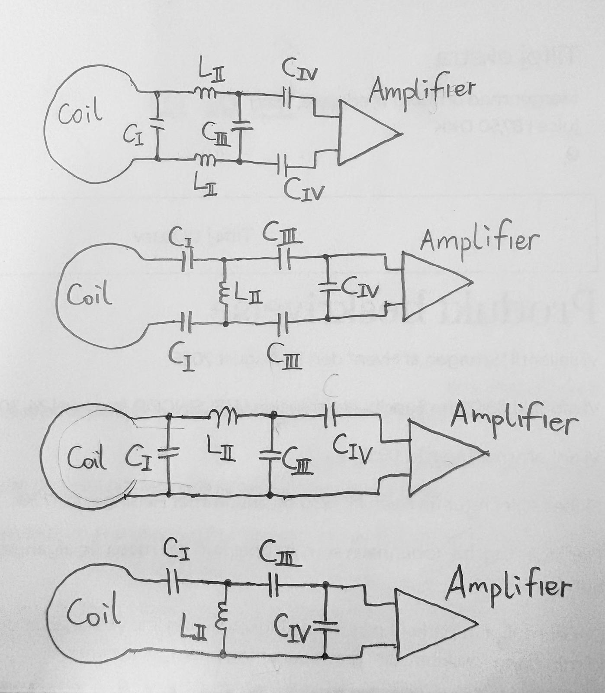
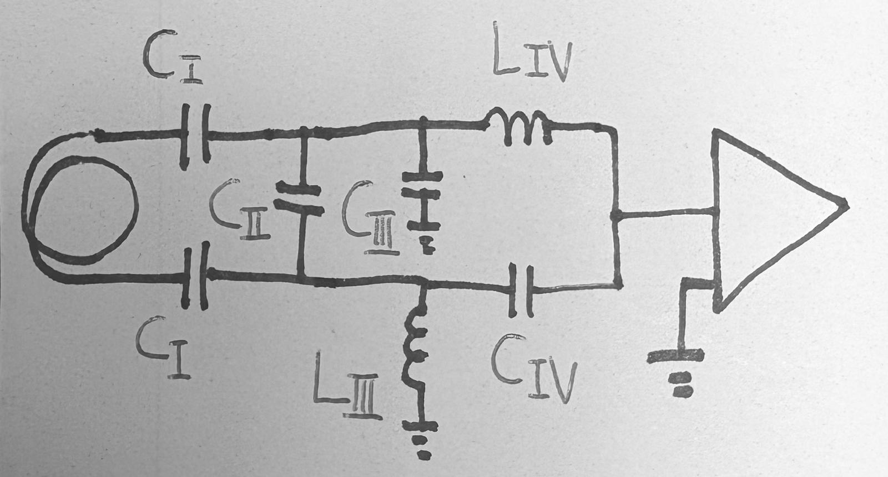
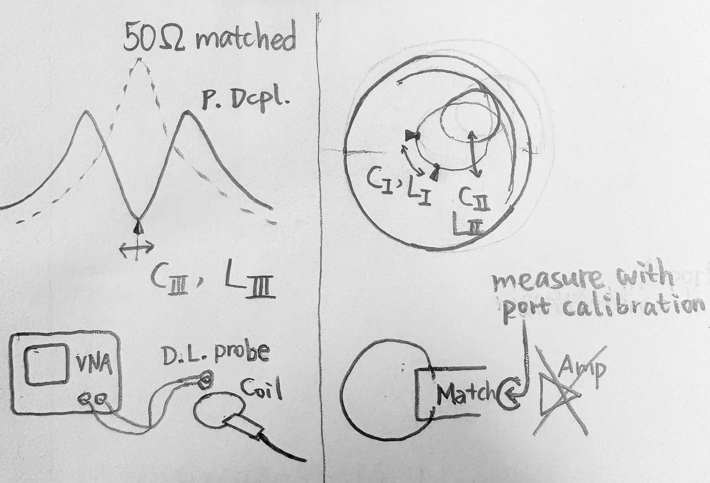
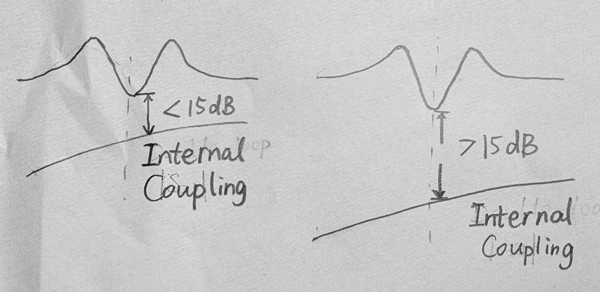
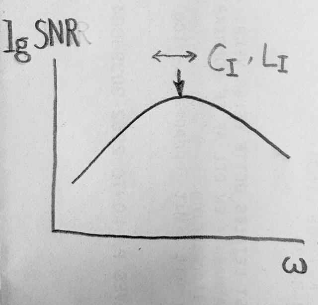
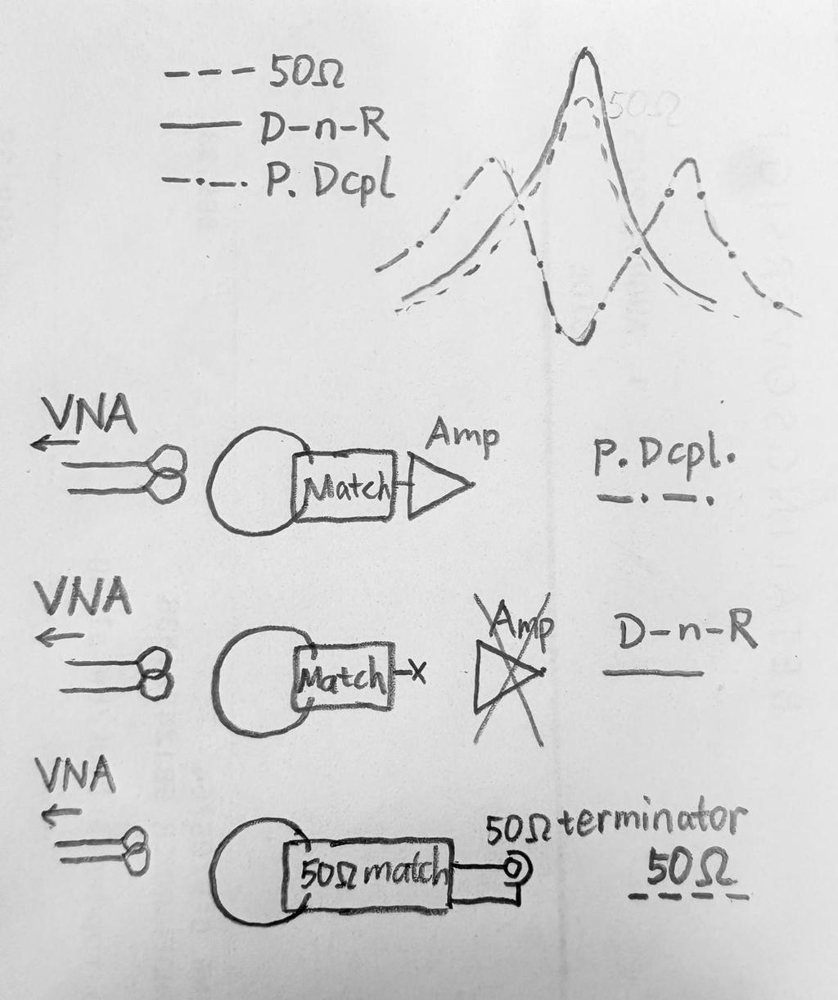

# Practicalities

## Table of Contents
- [Circuit Construction](#circuit-construction)
- [Component Selection and PCB Layout](#component-selection-and-pcb-layout)
- [PCB Assembly](#pcb-assembly)
- [Component Tuning](#component-tuning)
- [Questions](#questions)

## Circuit Construction
In some cases an MR coil can have an extremely high quality factor (Q). In these cases it is crucial to pick the suitable topology that:
- Has a relatively OK bandwidth, not crazily narrow, so that tuning will be kept OK when subject to different sample loading conditions.
- Minimizes the signal-to-noise figure (SNR) loss from impedance transform networks.  

For the bandwidth simulation, a schematic circuit simulation with ideal components is enough. For matching (impedance transform) network SNR simulation

It is recommended that one simulate circuit schematics before deciding on the topology. In this schematic: 
- Simulate with models of commercially available components. If a model is unavailable, make your own by reading the datasheets. Key data to look for are equivalent series resistance (ESR), quality factor (Q), dissipation factor (DF).
- Set the input port, generally port 1, as a port of reference impedance $`Z_{\mathrm{coil}}`$, or a port of reference impedance $`R_{\mathrm{coil}}`$ in series with an inductor of $`L_{\mathrm{coil}}`$, plus, if you have breaking capacitors, $`C_{\mathrm{break}}`$. Do not use 50 Ω as the reference impedance.
- Set the output port, generally port 2, as a port of reference impedance $`Z_{\mathrm{amp}}`$. You may also use 50 Ω as the reference impedance.
- Simulate the small-signal available power gain $`G_{\mathrm{av}}`$ or noise figure $`F`$. Their relation is $`G_{\mathrm{av}} F=1`$ as the network is passive.

After simulation, pick the one with a low noise figure. The high-noise-figure matching topologies can be lossier after implementation on a PCB, especially for very high Q MR coils, e.g. Q=300. An impedance transform network made entirely of high-Q components that kills the signal-to-noise ratio by 11.9 dB has been reported in [Wang2023-ISMRM](./References.md#Wang2023-ISMRM).

## Component Selection and PCB Layout
PCB layout is a deep topic that this `README` file cannot afford diving too much into. The most important points for MR coil PCB layout are below. 

For schematics: 
- Pick class I ceramic capacitors for your impedance transform network. They generally have temperature coefficients labelled "C0G" or "NP0". If possible, use ultra-low-ESR capacitors. Do not use class II ceramic, class III ceramic, electrolytic capacitors, etc. 
- Do not use ceramic-core inductors with thin wire winding for your impedance transform network. Use instead air-core inductors with thick wires.
- You may use ceramic-core inductors in active detuning circuits through which the MR signal do not pass when active detuning is off.
- If a tunable inductor is unavailable, put a small trimmer capacitor in parallel with it to increase its effective inductance.
- Put inductors far apart or perpendicular with each other to reduce mutual inductance. Do not put them head-to-head.
- Always put a filter capacitor (more widely called "decoupling capacitor" in datasheets and application notes):
    - where the DC power line enters a PCB—do not only put an inductor at + or - entries.
    - near the DC feeding pins of an amplifier module.
- Put a fast-switching diode pair in front of the amplifier input. The voltage can get quite high there after the voltage induced during MR scanner transmission at the MR coil is transformed by the impedance transform network.
- Put a coaxial testing point at the output of matching network, i.e., the input of a preamplifier. Use 0 Ω jumpers to control the connections. Avoid placing 0.1-inch headers on the MR signal path, which tend to pick up electromagnetic interference and make the amplifier oscillate. 
- If your impedance transform circuitry has no ground plane underneath, the interference emission and sensitivity will be strong. In this case, for one MR coil, do not put two sets of impedance transform networks on the same board and try to switch between them by placing jumpers or controlling mechanical switches. The electromagnetic interference will often screw up your tuning. One coil, one matching, one amplifier. 

The following are for layouts: 
- Set up your board constraints before drawing.
- Run a design rule check and a component connectivity check before you send your board for fabrication. **If you violate design rules, you will probably not receive a warning from your manufacturer, but that does not mean it will be OK.**
- Remember current always forms a loop. Where it flows forth, there must be somewhere for it to flow back. If a thread of current cannot flow back anywhere, it will emit an electromagnetic field. This means: 
    - Make a contiguous ground plane (current return plane) underneath your amplifier module. 
    - When there is no ground plane, make sure the loops formed by current forward and return traces are very small. 
- If your PCB is directly connected to your coil and is close to a sample, put only ground planes (current return planes) where it is necessary. A big, unnecessary patch of metal only serves to induce eddy currents, which kills SNR. This ground plane rule is unique to MR coils.
- Personally I have found putting a ground plane underneath a lattice balun, especially under the inductors therein, give me trouble. However, it might be my own experience only, so take it with a grain of salt.
- In some cases the amplifier characteristics can depend on its spatial relation with the static magnetic field $`B_0`$. 

These are not PCB layout itself but consider them for mechanical robustness: 
- Have a strain relief for a wire. For a DC wire, put a hole about 1 cm away from the soldering pad, and put the wire through the hole. 
- Avoid pigtail connections. If you use them for convenience, at least tie it to the board somewhere.
- Use connectorized connection if you can. 
- Follow assembly instructions, which are usually found on the manufacturers' websites. Use the right crimping tools when making connectors. Never freestyle your connector.

It is recommended that a designer simulate the PCB layout, whereby the preamplifier decoupling and the SNR performance vs frequency can be satisfactorily attained. During layout simulation: 
- Assign the board stack-up as specified by your PCB manufacturer, including copper thickness, dielectric thickness, dielectric permittivity and dissipation factor, solder mask properties (if applicable), etc. 
- Use face ports (edge-to-edge ports) rather than edge ports (point-to-point ports) if you can.
- Turn on edge mesh to capture the alternating current, of which most concentrates on the edges.
- Give at least 4 cells per dielectric wavelength of the highest frequency. I usually use 10–20 per dielectric wavelength.
- Turn on pre-processing or shape healing. Round off very thin slits, very small protrusions, etc. that serve only to screw up meshing while contributing nothing to results.
- Preview the initial mesh before starting a solver. 
- For MR applications, a solver that does not compute board radiation usually suffices.

PCB layout simulation generally doesn't capture the problems caused by lack of filter capacitors (decoupling capacitors) or big current loops. 

There are a few concerns for cryogenic circuitry: 
- Do not spill a single drop of liquid gas onto any component. 
- When an amplifier is cooled down, the DC bias can change. If the DC current is too low, the amplifier will probably malfunction. 
- Some diodes can exhibit magnetoresistance effect in a strong magnetic field when they are cooled. Namely, when the current flows perpendicular to the static magnetic field $`B_{0}`$, the diodes need a high voltage to turn on, after which they will burn off because of the strong heat dissipation. If such is the case, put the diodes parallel to the static magnetic field $`B_{0}`$. 

## PCB Assembly
- When putting on capacitors,    
    - Have an LCR meter at hand. Measure capacitance of every capacitor you’ll put on, even if their values are explicitly marked on the outside.     
    - Let the value markings face upside or outside, i.e. you should be able to read the markings after they've been mounted.
- Assemble screw connections as they should be. The right assembly always looks like screw head—washer—screw hole—washer—nut. **Screw in screws. Do not solder screws**.    
- When hand-soldering active detuning PIN diodes, do not exceed 300°C. Do not let the electrode contact melted solder for more than 2 seconds. Otherwise the diodes have a high chance to be burnt in soldering process.
- If ICs or PCB modules have big ground pads, e.g. WanTCom WMA32C, use a reflow solder oven, or use a special heater. Do not put a copper tape underneath and assume it'll work. 
- Wear an electrostatic wristband. If such a wristband is unavailable, touch some metal objects like tap cocks, kitchen sinks, etc., before you touch on any electronic parts, especially in the winter. During handling, move slowly. Don't stand up from your chair when you have sensitive devices on your hands.

## Component Tuning
> [!TIP]
> Prepare at least two full working days for the process if you are new.

### Tools
- A working double-loop H-field probe    
- A vector network analyzer    
- A DC power supply    
- Your board where a coaxial test point exists between the matching network and the preamplifier    
- Spare capacitors and inductors    
- Cables, connectors, adapters    
- A torque wrench; for SMA should $`\geq 0.45~\mathrm{N \cdot m}`$.
- (If double-loop calibration needed) fixtures like screws, tape, self-printed 3D fixtures    
### Rules of Thumb
The on-board tuning process is not that fixed compared with processes before. It is a bit back-and-forth procedure, and sometimes involves your judgement. However, the tuning process is not clueless. My experience is (also written in [Wang2022-Thesis](./References.md#Wang2022-Thesis), Procedure 2.3):
- The third component from the coil, $`C_{\mathrm{III}}`$ or $`L_\mathrm{III}`$, is mainly responsible for decoupling frequency. The higher $`C_{\mathrm{III}}`$ or $`L_\mathrm{III}`$, the lower the decoupling frequency.    
- The second component from the coil, $`C_{\mathrm{II}}`$ or $`L_\mathrm{II}`$, is often called "matching" capacitors. It is mainly responsible for output impedance range. It mainly affects the size of the S22 trajectory on a complex plane. (S22 is the impedance reading at the coaxial test point when the preamplifier is disconnected but the coil/loop is connected.)    
- The first component from the coil, $`C_{\mathrm{I}}`$ or $`L_\mathrm{I}`$, is often called "tuning" capacitors. It is mainly responsible for where the output impedance will be on the S22 trajectory. Provided that the noise parameters of the preamplifier are reliable, the impedance point will correspond to the SNR peak. The higher $`C_{\mathrm{I}}`$ or $`L_\mathrm{I}`$, the lower the SNR peak frequency.    

How to identify $`\bigcirc_\mathrm{I}`$, $`\bigcirc_\mathrm{II}`$, $`\bigcirc_\mathrm{III}`$, $`\bigcirc_\mathrm{IV}`$:  

How to identify $`\bigcirc_\mathrm{I}`$, $`\bigcirc_\mathrm{II}`$, $`\bigcirc_\mathrm{III}`$, $`\bigcirc_\mathrm{IV}`$ for matching networks with a lattice balun. $`L_\mathrm{III}=L_\mathrm{IV}`$, $`C_\mathrm{III}=C_\mathrm{IV}`$. At resonant frequency $`X\left[L_\mathrm{III}\right]=X\left[C_\mathrm{III}\right]`$:  

Functions of $`\bigcirc_\mathrm{I}`$, $`\bigcirc_\mathrm{II}`$, $`\bigcirc_\mathrm{III}`$:  

These are only rules of thumb, so they might not work for your case. 

> [!TIP]
> Be aware that the capacitor and inductor values you get can be very different from the initial calculations. For example, your initial value is 2000 pF but the actual value to be installed on the board can be 800 pF. Don't panic. It's normal.

### Tuning with a Camel-Hump Response
> [!IMPORTANT]
> This process only applies to matching networks with camel-hump frequency response 🐫. Refer to the page [*Special Notes on Camel-Hump Responses*](./Special_Notes_on_Camel-Hump_Responses.md) for other cases.

Before tuning, connect cables to VNA and try the cable length, so that you need not lengthen or shorten them during tuning. 

1. Connect the double-loop probe to the VNA. Set "Measure" to S21, unit dB. 
2. For now keep coils and big metallic structures away. Save the trace with a bare double-loop probe by pressing Trace → Mem → Data to Mem. This is the internal coupling within a double-loop probe.
3. Now you can bring back the coil near the double-loop probe. The preamplifier is connected, turned on, and its output is 50 ohm terminated.
    - Choose some appropriate distance between the double-loop probe and the coil. When they're too close you'll see the |S21| curve begin to deform. When they're too far the signal is too weak, either fading into noise or hitting the internal coupling. In a few seconds you can determine the right distance.
    - Choose also the right power on the VNA by pressing BW/Power/Avg. You can find the right power similarly—too much |S21| and the curve starts to deform, too little and the curve gets too noisy.
4. Tune $`L_\mathrm{III}`$ or $`C_\mathrm{III}`$ with the preamplifier connected, turned on *and its output 50 ohm terminated*, so as to align the double-loop probe's |S21| trough to the correct frequency. 
    - Note, if you find measured |S21| less than 15 dB over the internal coupling of double-loop probes, you should calibrate the double-loop probe. Otherwise you don't need double-loop calibration. 
    - The calibration procedure is described in the [`README.md`](../README.md) with an example described [in this file](./Double_Loop_Calibration__ZNL3__Rohde_Schwarz.md). It's trickier than the calibration-free case in that you need to fix the coil's and the double-loop probe's positions, so you may need some extra fixture, like screws, tape, etc. After calibration, go back to Step 4.  
      
5. After some time, you can run into two situations:  
(a) luckily, you have got |S21| trough almost to the right frequency;  
(b) unfortunately, you have tried hard and still can't get |S21| trough near the right frequency; meanwhile $`L_\mathrm{III}`$ or $`C_\mathrm{III}`$'s value has moved away too much from your initial values.   
Either case, disconnect the preamplifier, connect VNA's port 2 to the test point that sits right before the preamplifier and right after the matching. Get port 2 calibrated to where it goes to the test point. Then do the following: 
    - Tune $`L_\mathrm{II}`$ or $`C_\mathrm{II}`$ to get S22 to the right curve expanse.
    - Tune $`L_\mathrm{I}`$ or $`C_\mathrm{I}`$ to get $`Z_\mathrm{out}`$ to the right value at the Larmor frequency. 
    - Measure |S21| trough again. Is it still at where it should be?
        - Yes → Do Step 5 again. Does $`Z_\mathrm{out}`$ have the right value at the Larmor frequency?
            - Yes → Go to step 6.
            - No → Go to Step 5 again.
        - No → Go to Step 4.
6. Maximize the SNR at the desire frequency. There are two approaches. Choose that which is appropriate. 
    - In all cases: Connect the preamplifier. Measure the SNR. Tune $`L_\mathrm{I}`$ or $`C_\mathrm{I}`$ to move the SNR peak to the Larmor frequency.  
      
    - In the case where $`X_\mathrm{out} + X_\mathrm{amp} \approx 0`$, you may make use of "Disconnect and Resonate", which has been theoretically proven in [Wang2023-MRM](./References.md#Wang2023-MRM). Do these: 
        1. Connect the preamplifier, turn it on, terminated it by 50 ohm. The preamplifier decoupling trough should be at the Larmor frequency like "P. Dcpl" below. 
        2. Disconnect the preamplifier. You will see a single-peak curve like "D-n-R" below. Tune $`L_\mathrm{I}`$ or $`C_\mathrm{I}`$ to move the peak to the Larmor frequency.
        3. Connect the preamplifier, turn it on, terminated it by 50 ohm. Measure the SNR. Provided that all the noise parameters of the preamplifier are right, you should see the SNR peak is almost at the Larmor frequency without real need to further fine-tune.  
          
7. Now you've tuned preamplifier decoupling. Next is active detuning. It is hard to make a standardized procedure here as all active detuning circuitry differ. However, the principal steps are: 
    1. Perform a double-loop calibration. After a double-loop calibration do not move the double-loop or its cable connections.
    2. Tune the first L-C parallel resonator. 
        1. Install the inductor for the first L-C parallel resonator. 
        2. Measure the double-loop response. You should see a deep trough near the Larmor frequency. If not, change or tune the inductor to move the trough to the Larmor frequency. 
        3. Afterwards take away the inductor for the first L-C parallel resonator. Put the inductor in a place where you won't mix it up with other things.
    3. Tune the second L-C parallel resonator. Repeat step 7b. 
    4. Likewise tune all the remaining L-C parallel resonators. 
    5. Afterwards, install all the inductors suited for the L-C parallel resonators, and install all PIN diodes. 
    6. Plug on the preamplifier, turn it on, terminated it by 50 ohm. You get a familiar preamplifier decoupling curve.
    7. Let the preamplifier be on. Apply the active detuning control signal. Generally, you can do that with a current-controlled DC power source with 100 mA current limit; although you should always consult the PIN diodes' datasheets for a functioning value of forward current. After apply the active detuning control signal you should see the double-loop curve goes further down by more than 10 dB, and the curve's trough should be near the Larmor frequency.
8. Now all the tuning has been essentially completed. Now perform a rigorous test of the following specifications and save all the results:
    - Preamplifier decoupling curve with the double-loop calibrated, preamplifier connected, turned on and terminated by 50 ohm.
    - Active detuning curve with the double-loop calibrated, preamplifier connected, turned on and terminated by 50 ohm.
    - SNR vs. frequency sweep in the range Larmor frequency±4% with at least 51 points.

> [!TIP]
>Preamplifier decoupling tends to be erroneous when the coil Q is high. For coils with Q < 70 the measured preamplifier decoupling will be close to the calculated value.

## Questions
Q: I have tuned my matching network correctly. Preamplifier decoupling and output impedance look good. But the SNR peak doesn't align with Larmor frequency. Why?  
A: Generally, there'll be some errors with the preamplifier's noise parameter measurements, so the SNR peak can be a little off. But if the SNR peak is way off, or the SNR response looks completely different, consider these: 
- You might not have followed general PCB design guidelines. Check the [PCB Layout](#component-selection-and-pcb-layout) section above. However, PCB layout guidelines are generally scattered across datasheets and application notes so it is also hard to search on the Internet. You probably need some experienced engineer (better with industrial experience) to help you. 
- Your amplifier might have broken because of electrostatic discharge, over-voltage, over-current, etc. If your amplifier can be unplugged, try to measure the amplifier's characteristics on its own. 
- The noise parameters of an amplifier require an impedance tuner which are usually stub tuners. Such tuners hardly exist below 400 MHz, so anything under 400 MHz must be either extrapolated from measurement data (very bad) or derived from transistor models (acceptable). Probably there's something wrong with your preamplifier's noise parameters—you need to make sure the parameters are derived from transistor models.
