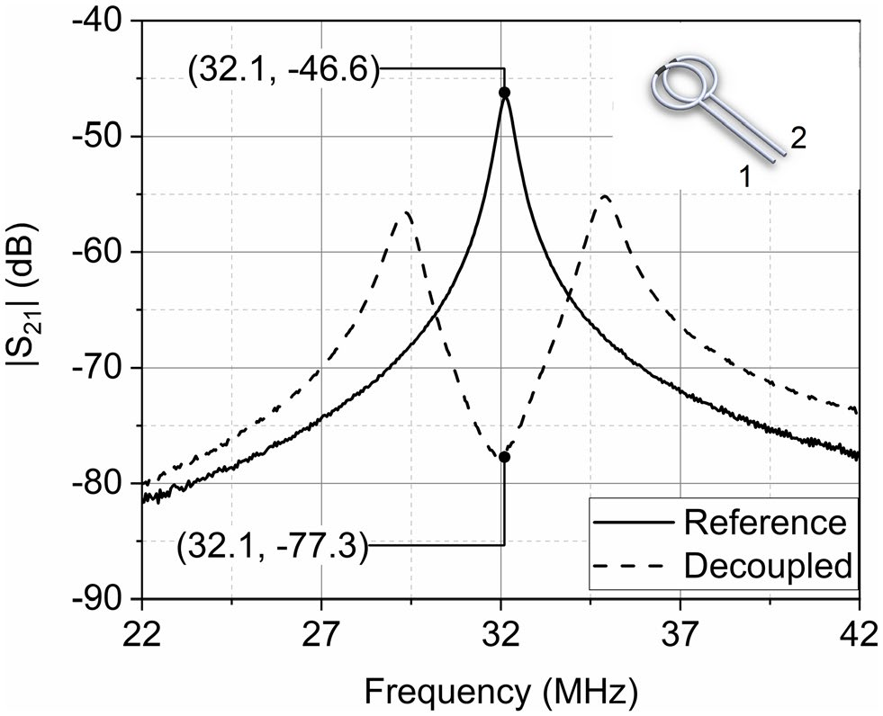
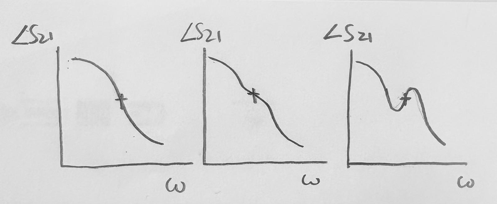
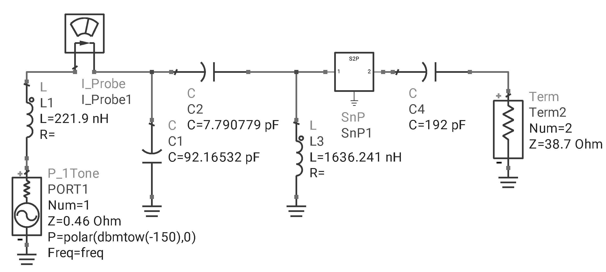
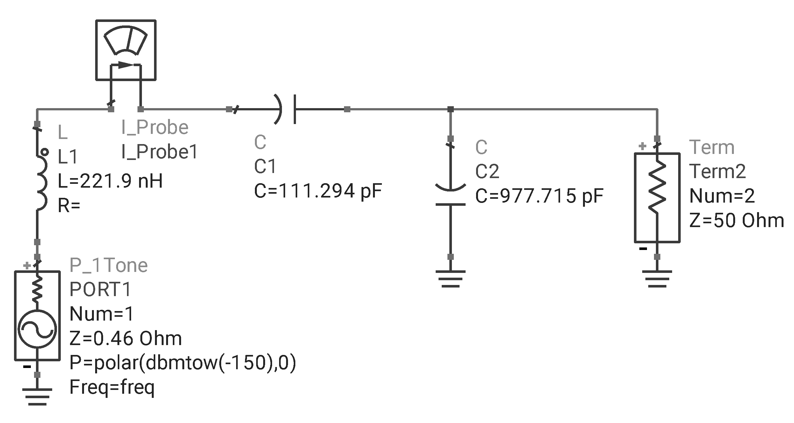
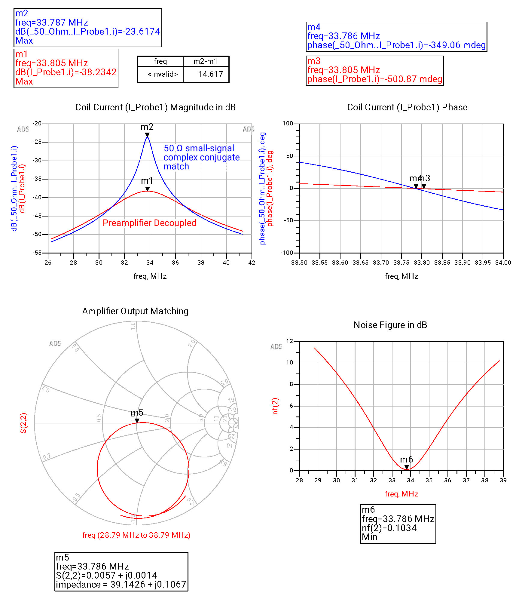

# Special Notes on Camel-Hump Responses (English)

> [!TIP]
> Even if simulations do not indicate your matching network will have a camel-hump double-loop probe response, in reality the camel humps likely still shows up after a little tuning. 

Generally the coil current curve vs frequency exhibits a camel-hump-like response, as shown below as "Decoupled":   

In some cases only one peak appears in a nearby frequency range and the peak aligns at the target frequency of design (Larmor frequency). In these cases the solutions can be are still valid as long as the conditions of validity are fulfilled. In such cases, some extra measures are needed to verify the impedance transform network solution in simulation and adjust the components in practice. 

In these cases, to verify the solution in simulation: 
1. Build an impedance matching network to any impedance, generally 50 Ω, at the target frequency $`f`$. Simulate the coil current $`I_{\mathrm{coil},1}`$ in this network.
2. Build a preamplifier decoupling impedance transform network between the preamplifier and the coil at the target frequency $`f`$. Simulate the coil current $`I_{\mathrm{coil},2}`$ in this network. 
3. Plot $`I_{\mathrm{coil},1}`$ and $`I_{\mathrm{coil},2}`$ in dB and read the difference in dB at $`f`$.

To adjust the components in practice, you need: 
- (A) A coil matched to 50 Ω at $`f`$, i.e. ordinary small-signal two-element maximum-power matching well described in textbooks;
- (B) The identical coil connected to a preamplifier through a preamplifier-decoupling impedance transform network that ought to give maximum preamplifier decoupling and the specified $`Z_{\mathrm{out}}`$ at $`f`$.

**Double-loop H-field probe calibration** is strongly recommended in coil current measurements. To do this: 
1. Measure the calibrated complex-number $`S_{21}`$ response of coil (A). Save the complex trace as $`S_{21,A}`$.
2. Measure the calibrated complex-number $`S_{21}`$ response of coil (B). Save the complex trace as $`S_{21,B}`$.

Note: 
- Keep your double-loop probe fixed at one position throughout all measurements. So are the phantoms and coils.
- Before performing calibration, ensure that a VNA calibration has been performed to the ends of the cables attached to the double-loop probe. 
- When performing double-loop calibration, ensure that averaging is on.
- The position of the 50 Ω-matched coil A should be the same as that of coil B. 

The frequency of maximum preamplifier decoupling generally satisfies: 
1. $`\angle S_{21,B}`$ is close to $`\angle S_{21,A}`$;
2. $`\mathrm{d}^2 \angle S_{21,B} / \mathrm{d}\omega^2 \approx 0`$, i.e., the phase of $`S_{21,B}`$ starts to kink in another direction, like marked below as "+".  

If you do it right, after some fine-tuning you shall see $`\left| S_{21,B} / S_{21,A} \right|`$ is (somewhat, in some cases very) close to your calculated preamplifier decoupling $`d=1-\left|\Gamma_\mathrm{out}\right|`$.

## An example of Single-Peak Response

> [!NOTE]
> This example is recorded in [Simonsen2022-ISMRM](./docs/References.md#Simonsen2022-ISMRM).

The parameters for calculation are $`f=33.786~\mathrm{MHz}`$, $`R_{\mathrm{coil}}=0.46~\Omega`$, $`L_{\mathrm{coil}}=221.9~\mathrm{nH}`$, $`Z_\mathrm{out}=75.6559+\mathrm{j} 4.2031~\Omega`$, $`Z_{\mathrm{amp}}=371.0625-\mathrm{j} 369.5953~\Omega`$. The expected preamplifier decoupling is $`0.185~840~5 \sim -14.617~\mathrm{dB}`$. The S parameters of the amplifier is [here in this repository](./assets/2021-09-27_Anders_Simonsen_amplifier_SKY67150.s2p).

A Π circuit is used. The circuit components are: $`C_{1}=92.16532~\mathrm{pF}`$, $`C_{2}=7.790779~\mathrm{pF}`$, $`L_{3}=1636.241~\mathrm{nH}`$. Apparently the circuit does not have two peaks; there is only one peak within a 15 MHz span near 33.786 MHz. However, after comparison against a 50 Ω small-signal complex conjugate matched case, it turns out that the Π impedance matching circuit delivers the right amount of preamplifier decoupling!

Π circuit for preamplifier decoupling:  
([Click here](./assets/Example_Simonsen_Preamplifier_Decoupling_Circuit.pdf) for a PDF version)  

50 Ω small-signal complex conjugate matching:  
([Click here](./assets/Example_Simonsen_50_ohm_Circuit.pdf) for a PDF version)  

Preamplifier decoupling, amplifier noise figure, amplifier output matching. The preamplifier is taken as the peak of 50 Ω small-signal complex conjugate matching and preamplifier decoupled coil current at 33.786 MHz. The preamplifier decoupling is 14.617 dB as expected. Because of some numerical errors during computation the preamplifier-decoupled peak is not exactly at 33.786 MHz. The noise figure is also the lowest at 33.786 MHz with a value of 0.1034 dB. The amplifier output is well-matched with S close to 0.  
([Click here](./assets/Example_Results_Current_and_Noise_Figure.pdf) for a PDF version)  
