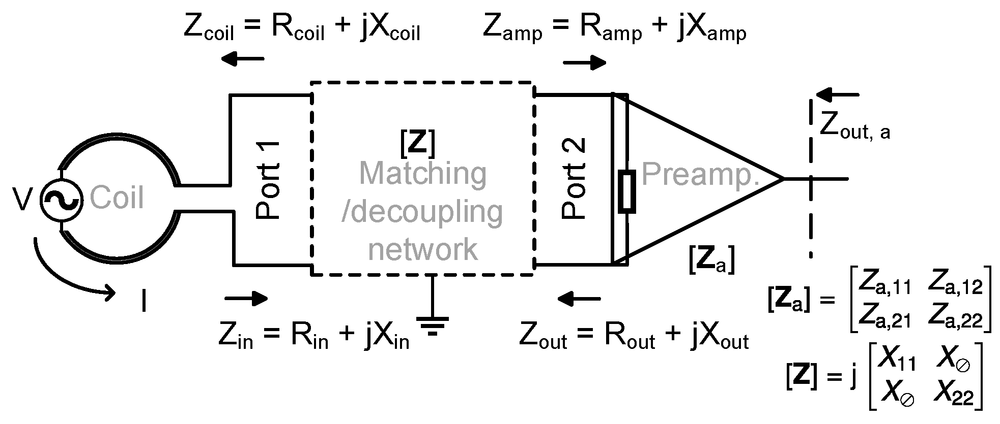
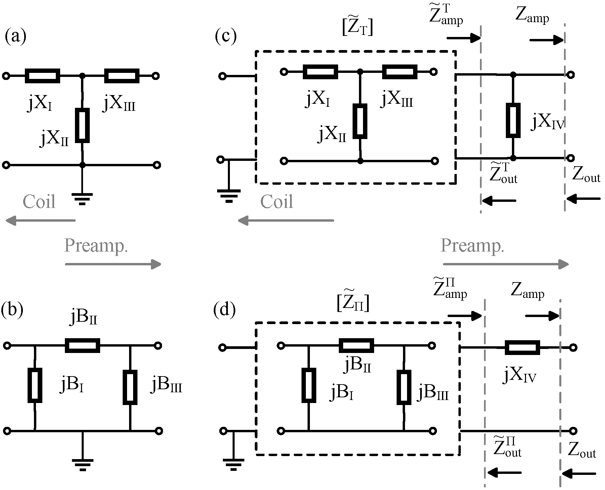

# Theory (English)

For conciseness only the results will be stated here. For detailed information, refer to [Wang-MRM2023](./References.md#Wang2023-MRM).

**Preamplifier decoupling** is a technique widely used in MR arrays that employs specially designed preamplifiers (low-noise amplifiers) and specially designed impedance transform L-C networks (impedance matching networks) to create high impedance for MR loop coils (near-field loop antennae operating in constant current flow). This high impedance helps block the current flow on a MR loop coil, which suppresses the sensitivity of the coil to changes in other coils and the coil's interference for other coil elements, thereby de-coupling each coil element.

In this program the quantities are defined as follows. $`\lg \stackrel{\mathrm{def}}{=} \log_{10}`$. Unless otherwise noted, $`R \stackrel{\mathrm{def}}{=} \mathrm{Re}~Z `$, $`X \stackrel{\mathrm{def}}{=} \mathrm{Im}~Z `$.

| Name                                              | Symbol & Definition                                                                                | Remarks                                                                                                                                                                                                                                                                                                              |
| ------------------------------------------------- | -------------------------------------------------------------------------------------------------- | -------------------------------------------------------------------------------------------------------------------------------------------------------------------------------------------------------------------------------------------------------------------------------------------------------------------- |
| Maximal preamplifier decoupling                   | $`d=1-\left\|\Gamma_\mathrm{out}\right\|`$                                                           | In dB $`=-20\lg\left(1-\left\|\Gamma_\mathrm{out}\right\|\right)`$                                                                                                                                                                                                                                                     |
| Gain relative to the maximum available gain       | $`\dfrac{G}{G_\mathrm{ma}}=1-\left\|\Gamma_\mathrm{out}\right\|^2`$                                  | In dB $`=10\lg\left(1-\left\|\Gamma_\mathrm{out}\right\|^2\right)`$                                                                                                                                                                                                                                                    |
| Matching output power-wave reflection coefficient | $`\Gamma_\mathrm{out}=\dfrac{Z_\mathrm{out} - Z_\mathrm{amp}^*}{Z_\mathrm{out} + Z_\mathrm{amp}}`$   |                                                                                                                                                                                                                                                                                                                      |
| Standing wave ratio                               | $`\beta=\dfrac{1+\left\| \Gamma_{\mathrm{out}} \right\|}{1-\left\| \Gamma_{\mathrm{out}} \right\|}`$ | $`\beta\geq 1`$. It is assumed that $`\beta > 1`$ in the program. When $`\beta=1`$, the problem is merely textbook complex conjugate matching.                                                                                                                                                                             |
| High matching network input impedance             | $`Z_{\mathrm{in}}^\mathrm{HZ}=\beta R_{\mathrm{coil}}-\mathrm{j}X_{\mathrm{coil}}`$                  | A matching network rendering such an impedance exists when $`X_{\mathrm{amp}}+X_{\mathrm{out}}\neq 0`$ or $`R_{\mathrm{out}} > R_{\mathrm{amp}} \geq 0`$.                                                                                                                                                                |
| Low matching network input impedance              | $`Z_{\mathrm{in}}^\mathrm{LZ}=\beta^{-1} R_{\mathrm{coil}}-\mathrm{j}X_{\mathrm{coil}}`$             | A matching network rendering such an impedance exists when $`X_{\mathrm{amp}}+X_{\mathrm{out}}\neq 0`$ or $`R_{\mathrm{amp}} > R_{\mathrm{out}} > 0`$.                                                                                                                                                                   |
| Matching network output impedance                 | $`Z_{\mathrm{out}}`$                                                                                 | The impedance presented by the matching network to the amplifier. It is generally the optimal noise impedance of the amplifier $`Z_{\mathrm{n,opt}}`$. You may also assign another value for it to get further decoupling at the cost of some noise performance.                                                       |
| Coil impedance                                    | $`Z_{\mathrm{coil}}`$                                                                                | Coil impedance. For low-input-impedance amplifier design it is generally the optimal noise impedance the amplifier module is expected to exhibit. It can be measured by installing capacitors and sensing the resonance frequency $`f_{r}`$ and overall $`Q`$. For very high Q coils remember to subtract capacitor ESR. |
| Amplifier input impedance                         | $`Z_{\mathrm{amp}}`$                                                                                 | The amplifier input impedance when its output is terminated by a given electric load.                                                                                                                                                                                                                                |



A matching network (impedance transform network) generating $`Z_{\mathrm{in}}^{\mathrm{HZ}}`$ exists when $`X_{\mathrm{amp}}+X_{\mathrm{out}}\neq 0`$ or $`R_{\mathrm{out}} > R_{\mathrm{amp}} \geq 0`$:
```math
\begin{aligned} 
X_{11} = X_{11}^{\mathrm{HZ}} & = - X_{\mathrm{coil}} + \beta R_{\mathrm{coil}} \eta_{\mathrm{HZ}}  , \\
X_{22} = X_{22}^{\mathrm{HZ}} & = - X_{\mathrm{amp}} + R_{\mathrm{amp}} \eta_{\mathrm{HZ}}  , \\
X_{\varnothing} = X_{\varnothing}^{\mathrm{HZ}} & = \pm \sqrt{R_{\mathrm{coil}}R_{\mathrm{out}}\left( 1+\beta^2 \eta_{\mathrm{HZ}}^2 \right)}  , 
\end{aligned}
```
where 
```math
\eta_{\mathrm{HZ}}=\dfrac{X_{\mathrm{amp}}+X_{\mathrm{out}}}{R_{\mathrm{amp}}-\beta R_{\mathrm{out}}}  .
```
$`X_{\varnothing}^{\mathrm{HZ}}`$ can be positive or negative; each corresponds to a set of solutions. When $`X_{\mathrm{amp}}+X_{\mathrm{out}} = 0`$ and $`R_{\mathrm{amp}} > R_{\mathrm{out}} \geq 0`$, like when $`R_{\mathrm{amp}}=50~\Omega`$, $`R_{\mathrm{out}}=5~\Omega`$, such a matching network does not exist. An example can be found [here](../docs/Example_of_Impossible_Matching.md).

A matching network (impedance transform network) generating $`Z_{\mathrm{in}}^{\mathrm{LZ}}`$ exists when $`X_{\mathrm{amp}}+X_{\mathrm{out}}\neq 0`$ or $`R_{\mathrm{amp}} > R_{\mathrm{out}} > 0`$:
```math
\begin{aligned}
X_{11} = X_{11}^\mathrm{LZ} &= -X_{\mathrm{coil}} + R_{\mathrm{coil}} \eta_{\mathrm{LZ}}  , \\
X_{22} = X_{22}^\mathrm{LZ} &= -X_{\mathrm{amp}} + \beta R_{\mathrm{amp}} \eta_{\mathrm{LZ}}  , \\
X_{\varnothing} = X_{\varnothing}^\mathrm{LZ} &= \pm\sqrt{ R_{\mathrm{coil}} R_{\mathrm{out}} \left( 1+\eta_{\mathrm{LZ}}^2 \right) }  ,
\end{aligned}
```
where 
```math
\eta_{\mathrm{LZ}}=\dfrac{X_{\mathrm{amp}}+X_{\mathrm{out}}}{\beta R_{\mathrm{amp}} - R_{\mathrm{out}}}  .
```
$`X_{\varnothing}^{\mathrm{LZ}}`$ can be positive or negative; each corresponds to a set of solutions. When $`X_{\mathrm{amp}}+X_{\mathrm{out}} = 0`$ and $`R_{\mathrm{out}} > R_{\mathrm{amp}} \geq 0`$, like when $`R_{\mathrm{amp}}=5~\Omega`$, $`R_{\mathrm{out}}=50~\Omega`$, such a matching network does not exist. 

## From Impedance Matrices to Three- and Four-Element Matching Networks

The following formulae are used to transform impedance matrices $`\mathbf{Z}^\mathrm{HZ}`$ or $`\mathbf{Z}^{\mathrm{LZ}}`$ to three- and four-element matching networks. 

Three-Element and Four-Element Impedance Transform (Matching) Networks. (a): three-element T; (b) three-element Π; (c) four-element TI; (d) four-element Π¯. <br />


> [!NOTE]
>These formulae can also be found in [Wang-Thesis2022](./References.md#Wang2022-Thesis), Chapter 2. Note on p. 15, (2.7), "$`B_\varnothing`$" on the right side should be "$`X_\varnothing`$".

### Converting an Impedance Matrix to a Three-Element T
```math
\begin{aligned}
X_\mathrm{I}&=X_\mathrm{11}-X_\varnothing \\
X_\mathrm{II}&=X_\varnothing \\
X_\mathrm{III}&=X_\mathrm{22}-X_\varnothing
\end{aligned}
```
$`X_{11}=X_{11}^\mathrm{HZ}`$ or $`X_{11}^\mathrm{LZ}`$ depending on your case. The same are for $`X_\varnothing`$ and $`X_{22}`$.

### Converting an Impedance Matrix to a Three-Element Π
First convert the impedance matrix to an admittance matrix, then convert the admittance matrix to a three-element Π circuit. 

Converting the impedance matrix to an admittance matrix:
```math
\begin{aligned}
B_{11} & = \dfrac{X_{22}}{X_\varnothing^2 - X_{11} X_{22}} \\
B_{22} & = \dfrac{X_{11}}{X_\varnothing^2 - X_{11} X_{22}} \\
B_\varnothing & = \dfrac{-X_\varnothing}{X_\varnothing^2 - X_{11} X_{22}}
\end{aligned}
```
Assign $`X_{11}=X_{11}^\mathrm{HZ}`$ or $`X_{11}^\mathrm{LZ}`$ depending on your case. The same are for $`X_\varnothing`$ and $`X_{22}`$. Throw in $`X^\mathrm{HZ}`$, and you get the corresponding $`B^\mathrm{HZ}`$. Throw in $`X^\mathrm{LZ}`$, and you get the corresponding $`B^\mathrm{LZ}`$. 

Throw $`B^\mathrm{HZ}`$ or $`B^\mathrm{LZ}`$ into the formulae below to convert an admittance matrix to a three-element Π circuit:
```math
\begin{aligned}
B_{\mathrm{I}} &= B_{11} + B_\varnothing\, , \\
B_{\mathrm{II}} &= -B_\varnothing\, , \\
B_{\mathrm{III}} &= B_{22} + B_\varnothing\, . \\
\end{aligned}
```

### Converting an Impedance Matrix to a Four-element TI
```math
\begin{aligned}
\tilde{Z}_\mathrm{amp}^\mathrm{T} = & \tilde{R}_\mathrm{amp}^\mathrm{T} + \mathrm{j} \tilde{X}_\mathrm{amp}^\mathrm{T} = \left[ Z_\mathrm{amp}^{-1} + \left( \mathrm{j} X_\mathrm{IV} \right)^{-1} \right]^{-1} \\
\tilde{Z}_\mathrm{out}^\mathrm{T} = & \tilde{R}_\mathrm{out}^\mathrm{T} + \mathrm{j} \tilde{X}_\mathrm{out}^\mathrm{T} = \left[ Z_\mathrm{out}^{-1} - \left( \mathrm{j} X_\mathrm{IV} \right)^{-1} \right]^{-1}
\end{aligned}
```
Afterwards put $`\tilde{Z}_\mathrm{amp}^\mathrm{T}`$ and $`\tilde{Z}_\mathrm{out}^\mathrm{T}`$ into $`Z_\mathrm{amp}`$ and $`Z_\mathrm{out}`$ respectively to get the impedance matrix. Then convert the impedance matrix to a three-element T as shown [above](#converting-an-impedance-matrix-to-a-three-element-t).

### Converting an Impedance Matrix to a Four-Element Π¯
```math
\begin{aligned}
\tilde{Z}_\mathrm{amp}^\mathrm{Π} = & \tilde{R}_\mathrm{amp}^\mathrm{Π} + \mathrm{j} \tilde{X}_\mathrm{amp}^\mathrm{Π} = R_\mathrm{amp} + \mathrm{j} \left( X_\mathrm{amp} + X_\mathrm{IV} \right) \\
\tilde{Z}_\mathrm{out}^\mathrm{Π} = & \tilde{R}_\mathrm{out}^\mathrm{Π} + \mathrm{j} \tilde{X}_\mathrm{out}^\mathrm{Π} = R_\mathrm{out} + \mathrm{j} \left( X_\mathrm{out} - X_\mathrm{IV} \right)
\end{aligned}
```
Afterwards put $`\tilde{Z}_\mathrm{amp}^\mathrm{T}`$ and $`\tilde{Z}_\mathrm{out}^\mathrm{T}`$ into $`Z_\mathrm{amp}`$ and $`Z_\mathrm{out}`$ respectively to get the impedance matrix. Then convert the impedance matrix to a three-element Π as shown [above](#converting-an-impedance-matrix-to-a-three-element-π).